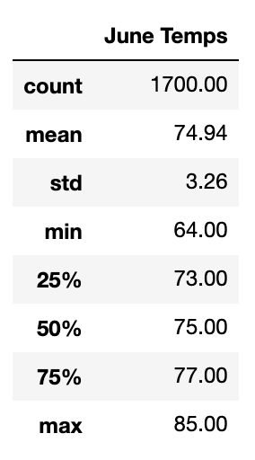
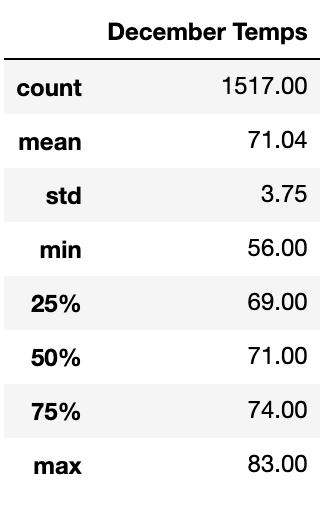

# Surf’s Up
Weather analysis using Python, SQLite, SQLAlchemy, and Flask.
## Project Overview
In this project we reviewed weather patterns and trends in Hawaii in order to check to open a surf and ice cream shop. It focused on precipitation, temperature for the months June and December to check if the shop can be sustained year round. To do that the following is performed:
- Accessed meteorological data in an SQLite file;
- Wrote queries to examine temperature data collected in the months of June and December;
- Calculated summary statistics (such as the min, max, and average temperatures collected).

## Results

This table summarizes June's temperature statistics over time.

This table summarizes December’s temperature statistics over time.

Some takeaways based on the weather patterns observed from the two tables above (temperatures are in °F unit):
1) The average temperature is 75 and 71 for the months of June and December respectively, this shows that the temperature for the two months is close and moderate and this also indicate that there is little fluctuation.
2) Regarding the maximum temperatures for the two months we see that for June it’s 85 and for December it’s 83 which also shows similarity and closeness in the weather patterns.
3) Regarding the minimum temperatures for June it’s 64 and for December it’s 56, this indicates high variance and for December this indicates that opening the surfing and ice cream shop might not be the best ideas as the temperature is considered low. Nonetheless, given the standard deviations for June and December which are 3.25 and 3.74 respectively, we would expect slight change between the two months numbers.
